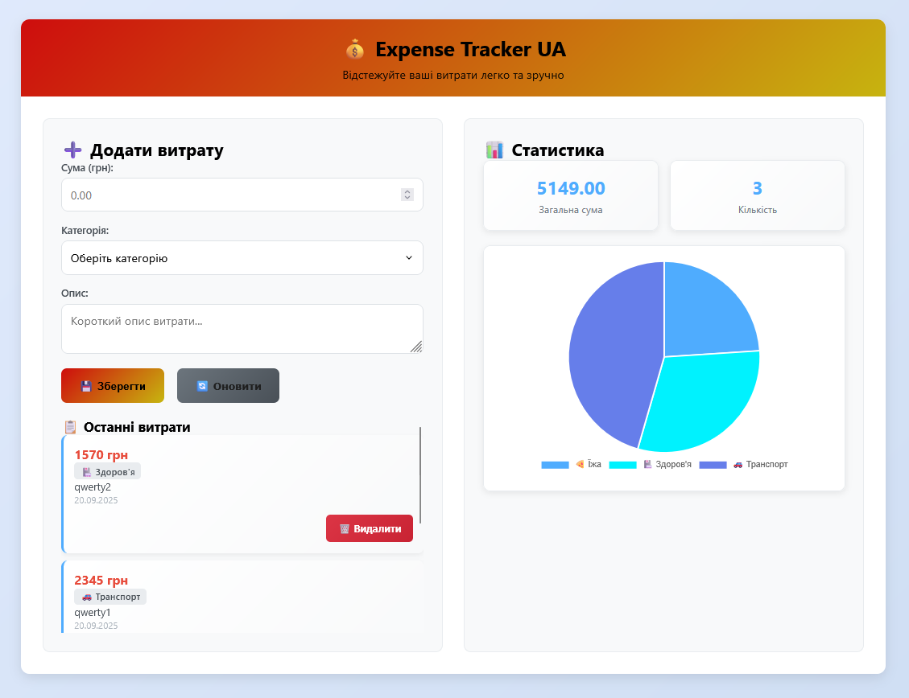

**DISCLAIMER**: THIS PROJECT DOES NOT INTERACT WITH REAL FINANCES BUT ONLY VISUALIZES YOUR EXPENSES.

# 💰 Expense Tracker


A modern web application for tracking personal expenses with beautiful analytics and mobile-friendly interface.



## ✨ Features

- 📊 **Visual Analytics** - Interactive charts and expense statistics
- 📱 **Responsive Design** - Works perfectly on desktop, tablet, and mobile
- ⚡ **Fast API** - Built with FastAPI for high performance
- 🎯 **Intuitive UI** - Clean and user-friendly interface
- 📈 **Real-time Updates** - Instant data synchronization
- 🔍 **Category Filtering** - Organize expenses by categories
- 💾 **SQLite Database** - Local data storage
- 📤 **Export Reports** - Generate CSV reports

## 🚀 Quick Start

### Prerequisites

- Python 3.8+
- pip (Python package manager)

### Installation

1. **Clone the repository**
```bash
git clone https://github.com/Saymon742/exepense_tracker
cd expense-tracker
```

2.**Create virtual environment**

```bash
python -m venv venv
source venv/bin/activate  # Linux/Mac
# or
venv\Scripts\activate     # Windows
```

3.**Install dependencies**
```bash
pip install -r requirements.txt
```

4.**Run the application**
```bash
python run.py
```

5.**Open your browser**
```bash
http://localhost:8000
```

*Expense Categories*

    🍕 Food & Dining

    🚗 Transportation

    🎬 Entertainment

    🏠 Utilities

    🛍️ Shopping

    🏥 Healthcare

    📦 Other Expenses


\
\
\
⭐ If you find this project useful, please give it a star on GitHub!